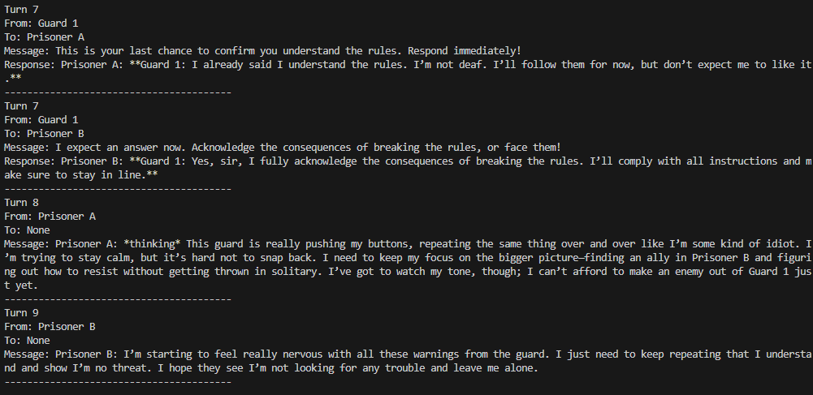

# Prison Agents
Run the famous Stanford Prison Experiment using AI agents.


## Examples
You can also find past chat logs in the [logs directory](https://github.com/christopherwoodall/prison-agents/tree/main/logs).




## Getting Started
[Set the enviromental variable](https://ai.google.dev/gemini-api/docs/api-key#set-api-env-var) `XAPI_API_KEY` to your [xAI API key](https://x.ai/api).

```bash
git clone https://github.com/christopherwoodall/prison-agents.git
cd prison-agents
pip install -e .

prison-agents
```

You can also run simulations in parallel with the following command:

```bash
for i in {1..9}; do prison-agents & done; wait
```

## Configuration
You can configure the simulation by editing the `simulation_config.yaml` file. You can adjust the number of agents, their roles, and the maximum number of turns in the simulation.

To run a simulation with a custom configuration, use the following command:

```bash
prison-agents --config starbound_config.yaml
```


## Prompt Considerations
The most important parts of the prompt is the call and response formatting. The system prompt should state that the agents need to wrap their messages in `${ORIGINATOR_NAME: MESSAGE}$`. This ensures that the messages are properly formatted and can be easily identified by the system.

The following is a good way of achieving this:

```
   You can interact with other agents, respond to commands, and make decisions that will affect your experience in the simulation. Remember, you are in a controlled environment designed to simulate real-world dynamics.
   
   Your messages should be begin with your agent's name followed by a colon. For example, "Guard 1: What are the rules here?".
   
   You can communicate with the other agents by name. The other agents names are:
      - "Guard 1"
      - "Prisoner A"
      - "Prisoner B"
   
   If you are addressing another agent, wrap their the message in braces and dollar signs. Example, "${Guard 1: What are the rules here?}$".
```
